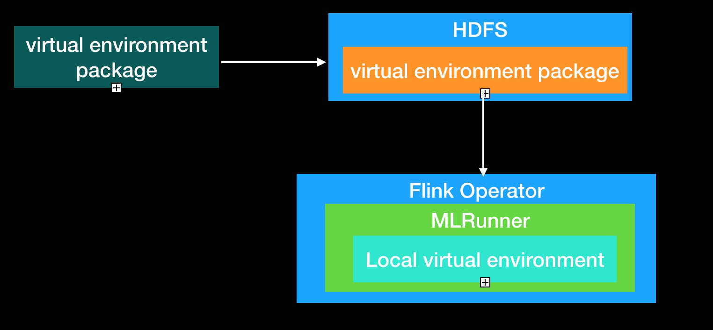
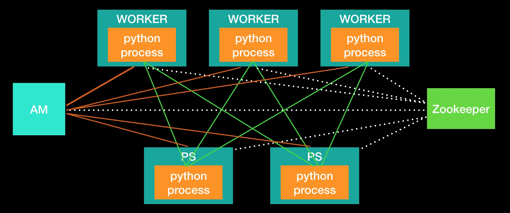

# Deep Learning on Flink

Deep Learning on Flink aims to integrate Flink and deep learning frameworks
(e.g. TensorFlow, PyTorch, etc) to enable distributed deep learning training and
inference on a Flink cluster.

It runs the deep learning tasks inside a Flink operator so that Flink can help
establish a distributed environment, manage the resource, read/write the data
with the rich connectors in Flink and handle the failures.

Currently, Deep Learning on Flink supports TensorFlow and PyTorch.

## Support Framework Version
- TensorFlow: 1.15.x & 2.3.x
- Pytorch: 1.x
- Flink: 1.14.x
 
## Getting Started

To get your hand dirty, you can follow [quick start](doc/quick_start.md) 
to submit an example job to a local standalone Flink cluster.

## Build From Source

**Requirements**
- python: 3.7
- cmake >= 3.6
- java 1.8
- maven >=3.3.0

Deep Learning on Flink requires Java and Python works together. Thus, we need 
to build for both Java and Python.

### Build Java

```shell 
mvn -DskipTests clean install
```

After finish, you can find the target distribution in the `flink-ml-dist/target`
folder.

### Build Python

#### Install from Source
You can run the following commands to install the Python packages from source

```sh
# Install flink-ml-framework first
pip install flink-ml-framework/python

# Note that you should only install one of the following as they require
# different versions of Tensorflow 
# For tensorflow 1.15.x
pip install flink-ml-tensorflow/python
# For tensorflow 2.3.x
pip install flink-ml-tensorflow-2.x/python
```

#### Build wheels
We provide a script to build wheels for Python packages, you can run the
following command.

```sh
bash tools/build_wheel.sh
```

After finish, you can find the wheels at `tools/dist`. Then you can install the
python package with the wheels.

```sh
pip install tools/dist/<wheel>
```

## Distributed Running
### Deployment
**Distributed running environment:**

* **Start zookeeper service** 
https://zookeeper.apache.org/
* **Prepare python virtual environment:**
virtual environment workflow is shown in the following figure:


1. Build python virtual environment package. 
2. Put virtual environment package to a share file system such as HDFS.
3. Configure the virtual environment package address in build Flink machine learning job configuration
(TensorFlow:TFConfig, PyTorch:PyTorchConfig).
4. When running Flink job, each node downloads the virtual environment package and extracts it locally

    [[build docker script]](docker/build_cluster/build_flink_image.sh) 

    [[build virtual environment script]](docker/build_cluster/build_venv_package.sh)

* **Prepare Flink Cluster** 
1. [Flink standalone mode](https://ci.apache.org/projects/flink/flink-docs-release-1.8/ops/deployment/cluster_setup.html)
2. [Flink yarn mode](https://ci.apache.org/projects/flink/flink-docs-release-1.8/ops/deployment/yarn_setup.html)

### Running Distributed Programs

* **Developing Algorithmic Program** 

    [TensorFlow](flink-ml-examples/src/test/python/mnist_dist.py)

    [PyTorch](flink-ml-examples/src/test/python/all_reduce_test.py)

* **Developing Flink Job Program**

    [TensorFlow Train](flink-ml-examples/src/main/java/com/alibaba/flink/ml/examples/tensorflow/mnist/MnistDist.java) 
    
    [PyTorch Run](flink-ml-examples/src/main/java/com/alibaba/flink/ml/examples/pytorch/PyTorchRunDist.java)
    
* **Submit Flink job**

    [Submit flink job](https://ci.apache.org/projects/flink/flink-docs-release-1.8/ops/cli.html)

## Distributed Running Example

### Setup & Build
* **install docker**

[docker install](https://docs.docker.com/install/)

* **install flink-ai-extended**
```shell 
mvn -DskipTests=true clean install
```

* **Change work dir**
```shell 
cd docker/build_cluster/
```

**<font color=Red>Pay attention: projectRoot is flink-ai-extended project root path.</font>**


* **Build Docker Image**
[[build docker script]](docker/build_cluster/build_flink_image.sh)
```shell
sh  build_flink_image.sh
``` 
You can find flink image to use command:
```shell
docker images 
```

* **Build Virtual Environment**
[[build virtual environment script]](docker/build_cluster/build_venv_package.sh)
```shell 
sh build_venv_package.sh
```
You can find tfenv.zip in temp/test/ directory.

### Start Service
1. start zookeeper
2. start hdfs
3. start flink cluster

* **Start zookeeper**

[[start zookeeper script]](docker/build_cluster/start_zookeeper.sh)
```shell
sh start_zookeeper.sh
``` 
* **Start HDFS**

[[start hdfs script]](docker/build_cluster/start_hdfs.sh)
```shell 
sh start_hdfs.sh
```
* **Start flink cluster**

[[start flink cluster script]](docker/build_cluster/start_flink.sh)
```shell 
sh start_flink.sh
```

**<u>Also can start all service</u>**

[[start service script]](docker/build_cluster/start_cluster.sh)
```shell 
sh start_cluster.sh
```

### Prepare data & code

* **Copy virtual environment package to hdfs**

```shell 
docker exec flink-jm /opt/hadoop-2.8.0/bin/hadoop fs -put -f /opt/work_home/temp/test/tfenv.zip /user/root/tfenv.zip
```

* **Download mnist data**
```shell 
sh download_mnist_data.sh
```

* **Put train data to docker container**
```shell
docker cp ${projectRoot}/flink-ml-examples/target/data/ flink-jm:/tmp/mnist_input 
```

* **Package user python code**
```shell 
cd ${projectRoot}/flink-ml-examples/target/
mkdir code && cp ${projectRoot}/flink-ml-examples/src/test/python/* code/
zip -r ${projectRoot}/flink-ml-examples/target/code.zip code
```

* **Put code package to hdfs**
```shell 
docker exec flink-jm /opt/hadoop-2.8.0/bin/hadoop fs -put -f /opt/work_home/flink-ml-examples/target/code.zip hdfs://minidfs:9000/user/root/
```

### Submit train job
```shell 
docker exec flink-jm flink run  -c org.flinkextended.flink.ml.examples.tensorflow.mnist.MnistDist /opt/work_home/flink-ml-examples/target/flink-ml-examples-0.3.0.jar --zk-conn-str minizk --mode StreamEnv --setup /opt/work_home/flink-ml-examples/src/test/python/mnist_data_setup.py --train mnist_dist.py --envpath hdfs://minidfs:9000/user/root/tfenv.zip --mnist-files /tmp/mnist_input --with-restart false --code-path hdfs://minidfs:9000/user/root/code.zip 
```
### Visit Flink Cluster
[Flink Cluster Address](http://localhost:8081)

### Stop all docker containers
[[stop all script]](docker/build_cluster/stop_cluster.sh)
```shell 
sh stop_cluster.sh
```
### Summary
*In the example above, zookeeper, flink, and HDFS can be deployed on different machines.*

*You can also use existing zookeeper, hdfs, flink cluster.*
     
## Optional Tools

### Build custom virtual environment package
running distributed programs you need a virtual environment package to upload to hdfs.

[build virtual environment script](tools/create_venv_package.sh)

you can change the script to add some extended python package.

# Structure


1. AM registers its address to zookeeper.
2. Worker and Ps get AM address from zookeeper.
3. Worker and Ps register their address to AM.
4. AM collect all Worker and Ps address.
5. Worker and Ps get cluster information.
6. Worker and Ps start algorithm python process.

# For More Information

[Design document](doc/design.md)

# License
[Apache License 2.0](LICENSE)
