# TensorFlow On Flink Design

## Background
Flink is widely used in data processing and Feature Engineering.
Tensorflow is widely used in the field of deep learning.
Do a machine learning project that uses both Flink and TensorFlow as shown below:
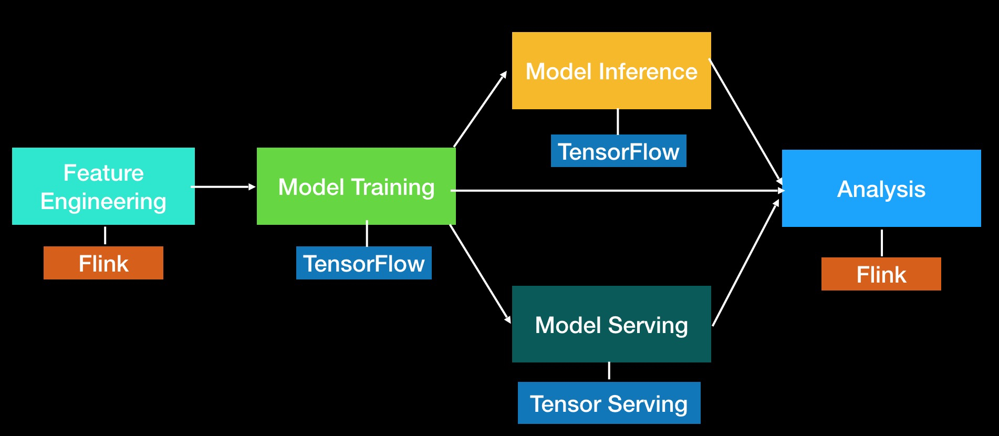
1. Feature Engineering and Data Processing using Flink Processing.
2. Model training and inference using tensorflow Processing.

This project combines tensorflow with flink, and processes feature engineering, data processing, 
model training and model inference in a cluster as shown below:
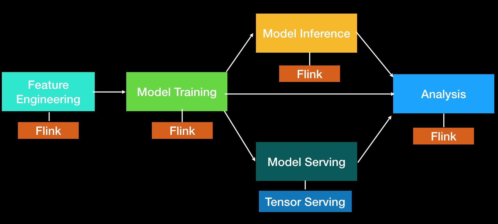

## Structure
This project includes the following modules:ML-Framework, ML-Operator, TensorFlow, PyTorch as shown below:
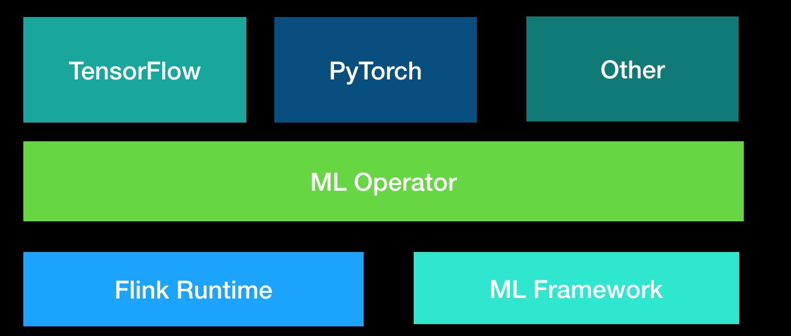

1. Framework module is a library to create and manage machine learning cluster.
2. Operator module is a library to plan machine learning cluster as a flink job.
3. TensorFlow module is a library responsible for creating distributed tensorflow job on Flink job.
4. PyTorch module is a library responsible for creating distributed pytorch job on Flink job.

## Framework
This module contains am(application master) and node roles as shown below:
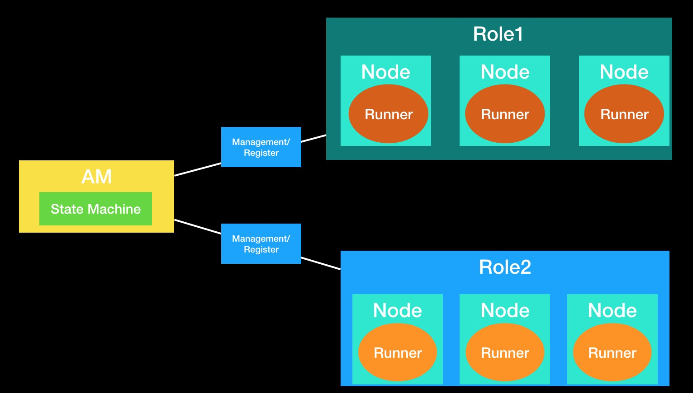

1. AM is responsible for managing the lifecycle of the machine learning cluster.
2. Node role is responsible for starting the python process of the algorithm.
3. The state machine is an abstraction in AM role.
The state machine is responsible for the state management of the machine learning job.
According to different machine learning frameworks, the state machine logic is different, 
so the state machine can be customized.
4. The runner is an abstraction in node role.
Node is responsible for preparing the running environment of the algorithm and starting the algorithm process.
Runner has different running logic according to different machine learning frameworks, so runner can be customized

**Common state machine**
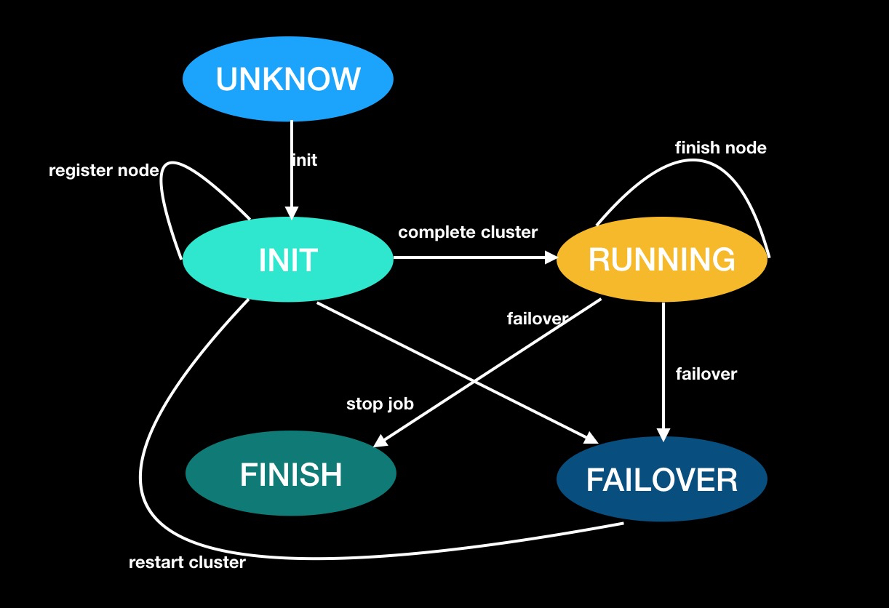

**How to exchange data between flink java process and algorithm python process as shown below:**
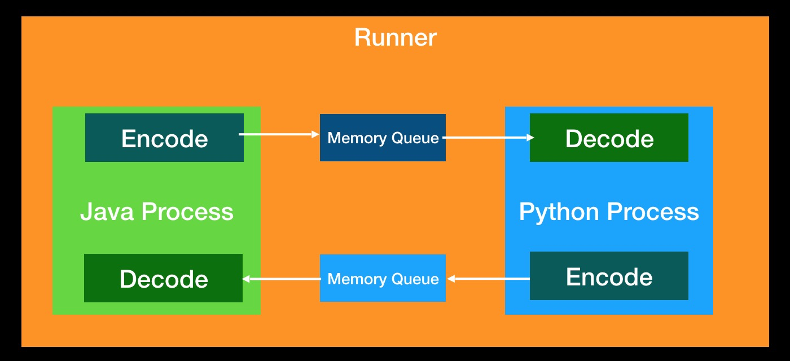
1. In Flink process, Encode transfer java object to byte[] then set to memory queue.
2. In Flink process, Decode get byte[] from memory queue then transfer to java object.
3. In python process, Encode transfer python object to byte[] then set to memory queue.
4. In python process, Decode get byte[] from memory queue then transfer to python object.

## Operator
This module wraps Node role and AM role into Flink operator and provides the ability 
to create machine learning cluster on Flink job.
This module contains the following API:
1. addAMRole(Config): Add AM role to machine learning cluster.
2. addRole(RoleName, Config): Add a custom role to machine learning cluster.

Create a machine learning cluster example as shown below:
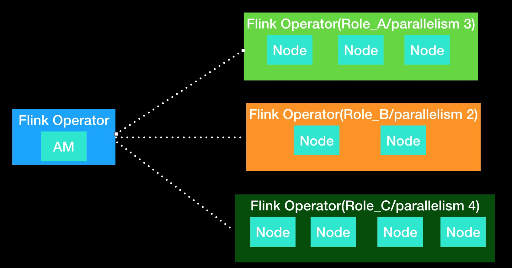

1. addAMRole(Config)
2. addRole(Role_A, Config)
3. addRole(Role_B, Config)
4. addRole(Role_C, Config)

## TensorFlow
This module provides tensorflow training (online training, offline training) and inference in Flink cluster.
TensorFlow batch run mode as shown below:

1. TensorFlow worker and ps plan as Flink Source operator.
2. TensorFlow worker and ps communicate with each other using grpc. Flink operator just start python process.
3. TensorFlow job read sample files from tensorflow operator such as tf.data.Dataset.

TensorFlow stream run mode as shown below:

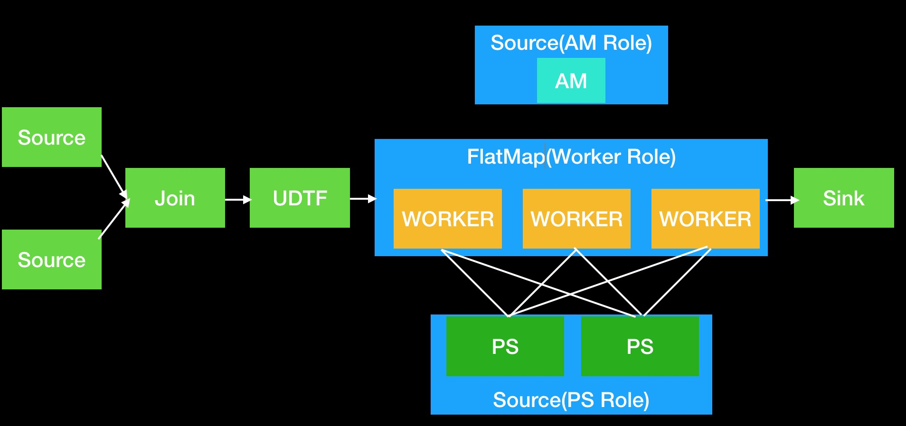
1. TensorFlow ps plan as Flink Source operator.
2. TensorFlow worker plan as Flink FlatMap operator. 
This role can receive data from Flink upstream and send data to Flink downstream.
3. TensorFlow worker upstream Flink source,join etc operator can do feature engineering.

TensorFlow inference run mode as shown below:

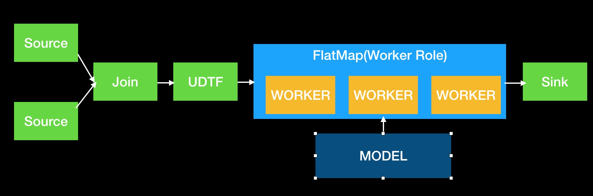
1. TensorFlow worker upstream Flink source,join etc operator generated samples then send to worker role.
2. In the initialization phase, worker load the model from the file system.
3. In inference mode, worker use tensorflow java api to process samples.

## PyTorch
This module provides pytorch training (online training, offline training) in Flink cluster.

PyTorch batch run mode as shown below:
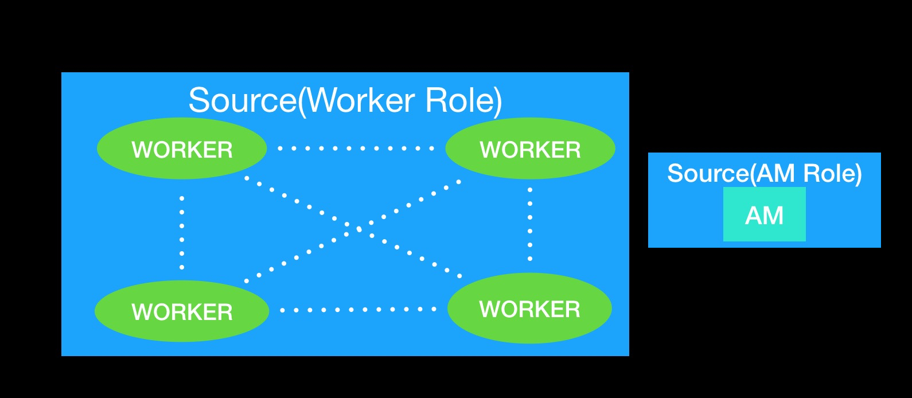
1. PyTorch worker plan as Flink Source operator.
2. PyTorch workers communicate with each other using gloo. Flink operator just start python process.
3. PyTorch job read sample files using python function.                                                            

PyTorch stream run mode as shown below:
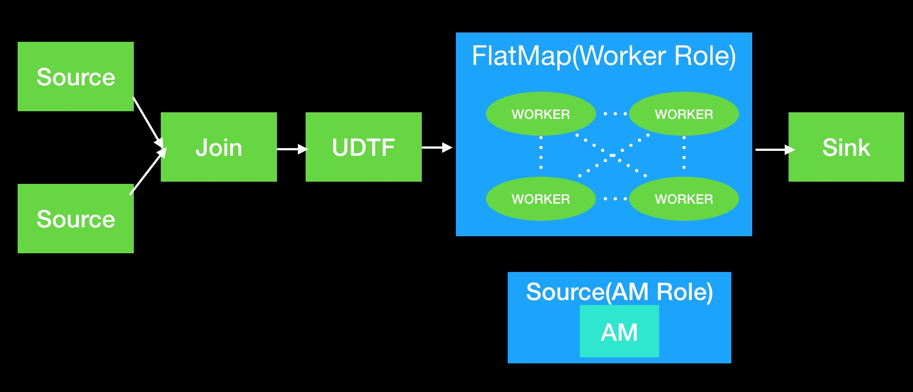
1. PyTorch worker plan as Flink FlatMap operator.
3. PyTorch worker upstream Flink source,join etc operator can do feature engineering then send result date to downstream.
                                                          
