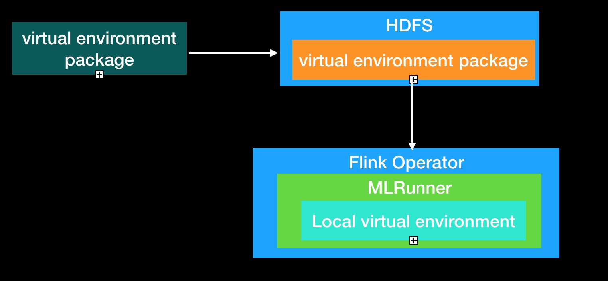

# TensorFlow On Flink Usage

## Deployment
**Distributed running environment:**

* **Start zookeeper service** 
https://zookeeper.apache.org/
* **Prepare python virtual environment:**
virtual environment workflow is shown in the following figure:

1. Build python virtual environment package. 
  [[build docker file]](../docker/flink/Dockerfile) 
  [[build script]](../docker/flink/create_venv.sh)
2. Put virtual environment package to a share file system such as HDFS.
3. Configure the virtual environment package address in build Flink machine learning job configuration
(TensorFlow:TFConfig, PyTorch:PyTorchConfig).
4. When running Flink job, each node downloads the virtual environment package and extracts it locally

* **Prepare Flink Cluster** 
1. Flink standalone mode: https://ci.apache.org/projects/flink/flink-docs-release-1.8/ops/deployment/cluster_setup.html
2. Flink yarn mode: https://ci.apache.org/projects/flink/flink-docs-release-1.8/ops/deployment/yarn_setup.html

## Running Distributed Programs

* **Developing Algorithmic Program** 

    [TensorFlow](../flink-ml-examples/src/test/python/mnist_dist.py)

    [PyTorch](../flink-ml-examples/src/test/python/all_reduce_test.py)

* **Developing Flink Job Program**

    [TensorFlow Train](../flink-ml-examples/src/main/java/com/alibaba/flink/ml/examples/tensorflow/mnist/MnistDist.java) 
    
    [PyTorch Run](../flink-ml-examples/src/main/java/com/alibaba/flink/ml/examples/pytorch/PyTorchRunDist.java)
    
* **Submit Flink job**

    [Submit flink job](https://ci.apache.org/projects/flink/flink-docs-release-1.8/ops/cli.html)