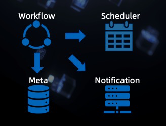

# Flink AI FLOW

Flink AI Flow is an open source framework that bridges big data and AI. 
It manages the entire machine learning project lifecycle as a unified workflow, including feature engineering, 
model training, model evaluation, model service, model inference, monitoring, etc. 
Throughout the entire workflow, Flink is used as the general purpose computing engine.

In addition to the capability of orchestrating a group of batch jobs, 
by leveraging an event-based scheduler(enhanced version of Airflow), 
Flink AI Flow also supports workflows that contain streaming jobs. Such capability is quite useful for complicated
real-time machine learning systems as well as other real-time workflows in general.

You can use Flink AI Flow to do the following:

1. Define the machine learning workflow including batch/stream jobs.

2. Manage metadata(generated by the machine learning workflow) of date sets, models, artifacts, metrics, jobs etc.

3. Run the machine learning workflow.

4. Publish and subscribe events

To support online machine learning scenarios, notification service and event-based schedulers are introduced.
Flink AI Flow's current components are:

1. SDK: It defines how to build a machine learning workflow and includes the api of the Flink AI Flow.

2. Notification Service: It provides event listening and notification functions.

3. Meta Service: It saves the meta data of the machine learning workflow.

4. Event-Based Scheduler: It is a scheduler that triggered jobs by some events happened.

## Documentation

### QuickStart

You can use Flink AI Flow according to the guidelines of [QuickStart](QUICKSTART.md).

### API

Please see the [API Documentation](doc/api.md) to find the interfaces supported by Flink AI Flow.

### Design

Please see the [Design Documentation](doc/design.md) to know the design principle of Flink AI Flow.

## Examples

You can refer to some simple usage examples of Flink AI Flow.
Please see the [Simple Examples](examples/simple_examples).

## Contributing

We happily welcome contributions to Flink AI Flow. Please see our [contribution guide](https://github.com/jinxing64/flink-ai-extended/blob/master/CONTRIBUTING.md) for details.
