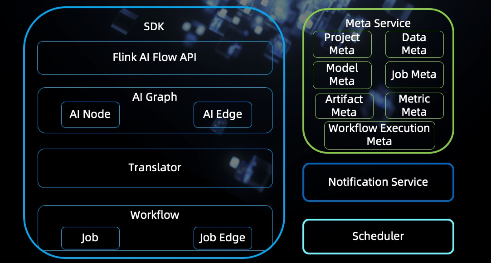
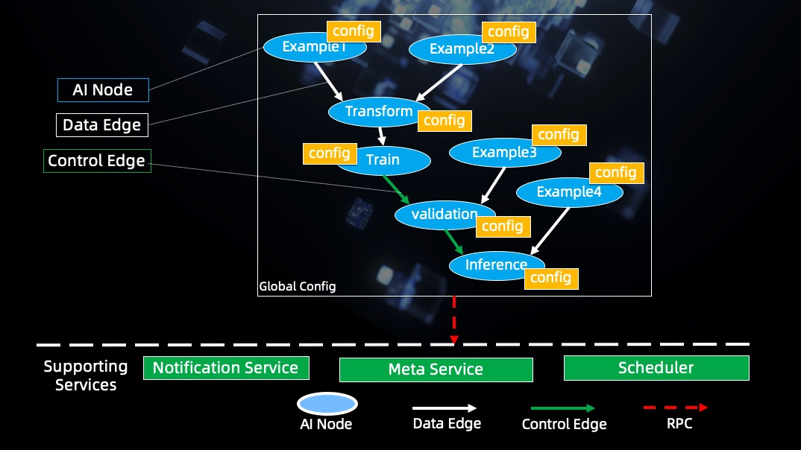
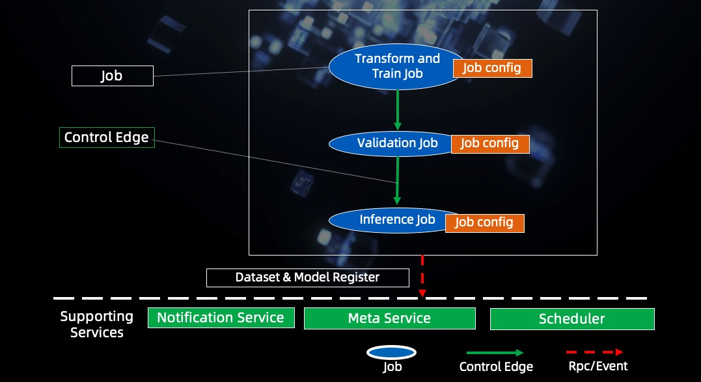
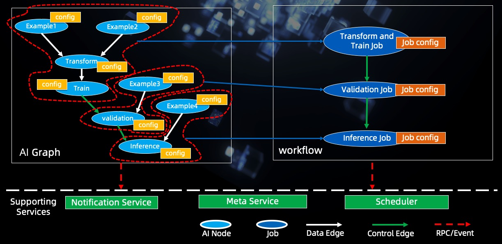
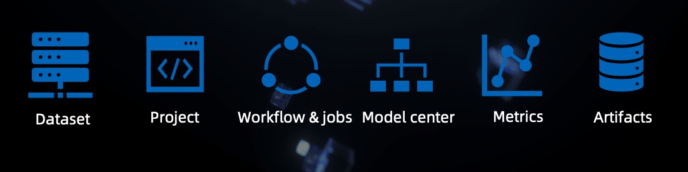
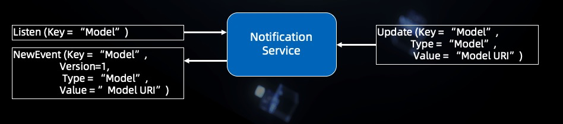
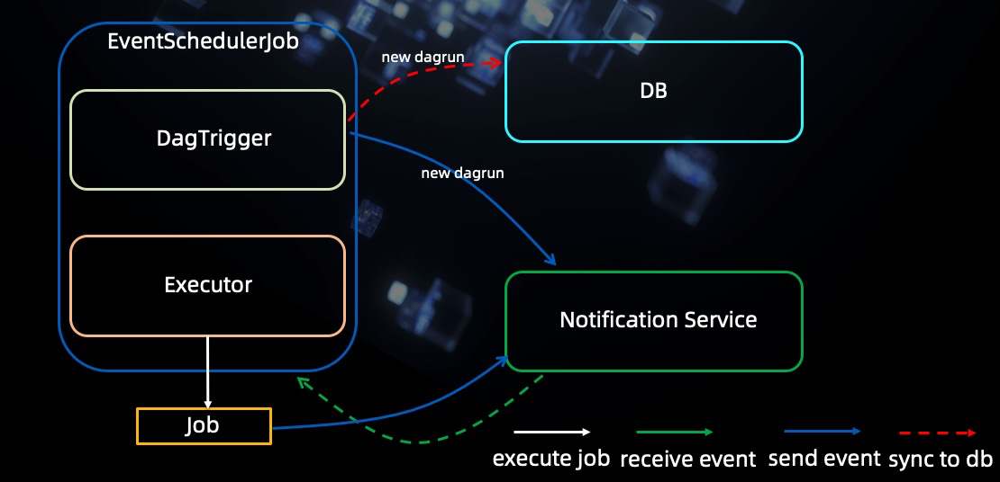

# Flink AI Flow Design Document

## Introduction

Flink AI Flow is an open source platform to manage the machine learning lifecycle, including feature engineering, 
model training, model evaluation, model serving, model inference, metric monitoring, etc.

## Architecture
 
The composition of the Flink AI ​​Flow is shown in the figure below:

Flink AI Flow has a SDK and three Services(Meta Service, Notification Service, Scheduler)

1. SDK: Define how to build a machine learning workflow and the client api of the three services.

    1. Flink AI Flow API: It provides the interface of defining machine learning workflow, 
workflow submission, event notification and meta information addition, deletion, modification and query etc.

    2. AI Graph: A logical calculation diagram generated from a user-defined program. It consists of AI node and AI edge. 
AI node defines the operation logic of a stage; AI edge defines the relationship between the AI nodes.

    3. Translator: Translator translates the AI Graph into executable workflow.

    4. Workflow: Workflow consists of job and job edge. 
Job is an executable unit translated from a set of AI nodes. Job edge describes the control relationship between jobs.

2. Meta Service: Meta service is responsible for managing meta information of Flink AI flow project.
It includes data set meta, model meta and project meta etc.

3. Notification Service: It provides event listening and notification functions.

4. Scheduler:The scheduler receives the workflow scheduling request and schedules the jobs to run.

## AI Graph

AI Graph: As shown in the figure below, it consists of AI node and AI edge. 
There are two types of AI edge, data edge and control edge.

1. AI Node: It defines a type of machine learning logical operation., such as transform, train etc.
2. Data edge: Node operation depends on upstream data.
3. Control edge：The operation of nodes depends on the control conditions defined by the edges.

## Workflow

Workflow：It is defined as a set of dependent jobs and the scheduler can schedule and run it.
Workflow is composed of job and control edge.

1. Job：It is a unit that the scheduler can run.
2. Control edge: It defines the conditions for the scheduler to schedule jobs.

## Translator

Translator: It converts logical ai graph into workflow that the scheduler can execute.

The working steps of the translator are as follows:
1. Split ai graph by control edges.
2. Translate the sub graphs to jobs.
3. Add the control edges to the workflow.

## Meta Service

Meta Service: Provides the CRUD(Create, Read, Update and Delete) service of metadata generated in the workflow of machine learning tasks.

The services provided are shown in the figure below:

1. Dataset: The meta data of the data set, including batch data such as hdfs files, streaming data such as kafka data.
2. Project: The meta data of the project which
3. Workflow&jobs: The meta data of the workflow and the jobs running history.
4. Model Center: The meta data of the model. 
It contains the description information of the model and the version information of the model.
5. Metric: The meta data of the metric, such as model version evaluate metric, etc.
6. Artifacts: The meta data of the artifacts such as configuration files, jar packages etc.

## Notification Service

Notification Service: It is a service that provides event sending and event notification.

Its working steps are shown in the figure below:

1. A consumer listens the event which the key field equals 'Model'.
2. A producer sends the event to the Notification Service.
3. Then the consumer received the event.

The source code of the notification service: 

[notification service](../lib/notification_service)

## Scheduler

Scheduler: It schedules the job according to the job description and the running conditions of the job defined in the workflow.

The traditional scheduler can only schedule batch jobs (when upstream job finished then downstream jobs can run) 
but in the online learning scenario it does not meet the demand. So we developed an event-based scheduler(EventSchedulerJob) based on airflow.

[event-based airflow](../lib/airflow)

The scheduler's structure is shown in the figure below:

The scheduler has two components:
1. DagTrigger: It scans a directory to find which dag can be scheduled and create a DagRun instance.
2. Executor: It executes the task which the scheduler submitted to it.

A typical scheduling steps is as follows:
1. The DagTrigger finds a dag can be scheduled then it creates DagRun instance 
and saves the DagRun's information to database while sending a new dag run event to Notification Service.
2. The Scheduler finds the tasks which can be scheduled and call the executor to run them.
3. The Executor starts the tasks as a job .
4. The job sends some events to the Notification Service.
5. The scheduler listens the event the finds which tasks can be scheduled, then call the executor to run them.
6. When all tasks of the dag are finished, the dag run is finished.
